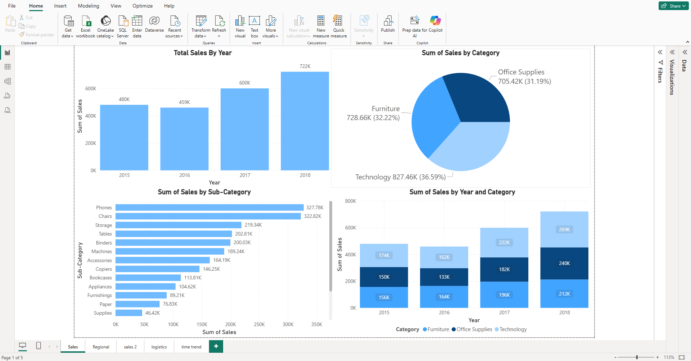
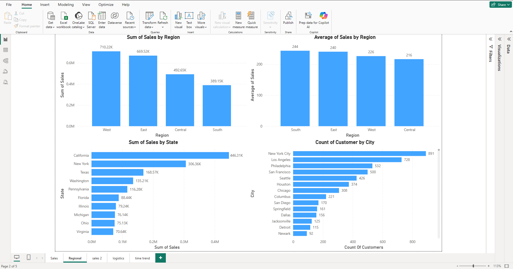
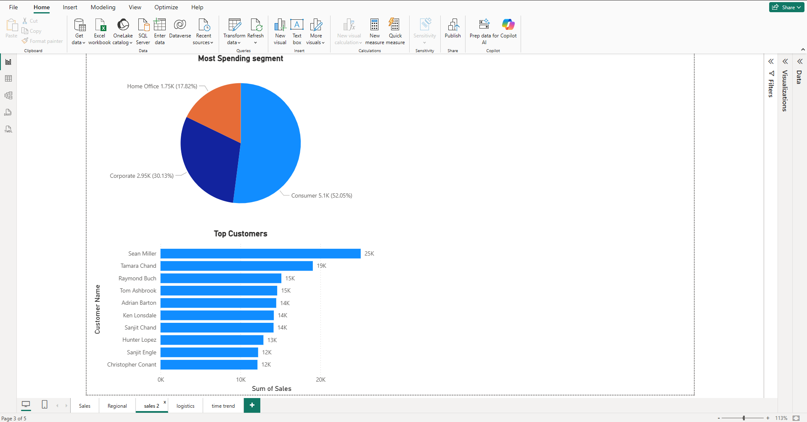
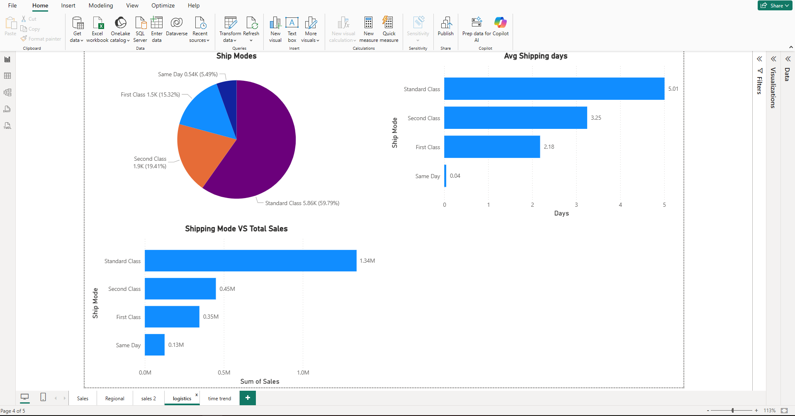
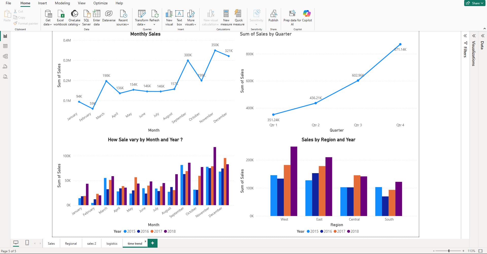

# Super Market Analysis — Power BI Dashboard

This Power BI project analyzes Superstore-style retail data, covering sales performance, customer insights, and shipping efficiency.  
The dashboard includes multiple pages with interactive filters for Category, Year, and Region.

---

## 🎥 **Dashboard Preview (GIF)**

---

## 🖼️ **Main Dashboard Pages**

### **1️⃣ Dashboard — KPI Overview + Monthly Trend**

#### **Insights**
- Total Sales: **2.26M**, Orders: **9.8K**, Customers: **793**  
- Average delivery time remains **4 days**, indicating stable logistics.  
- Sales peak in **March, September, and November**, showing seasonal demand.  
- Top-selling sub-categories: **Phones**, **Chairs**, **Storage**, **Tables**.  
- **Standard Class** dominates shipping mode usage (~60%).

---

### **2️⃣ Dashboard — Filtered View (Example: Furniture + Central)**

#### **Insights**
- Sales drop to **92K** when filtered to Furniture-only and Central region.  
- Category contribution shifts: **Chairs** and **Tables** become the highest sellers.  
- Monthly sales trend becomes more volatile due to reduced sample size.  
- Shipping modes maintain similar proportions even after filtering.

---

---

## 📊 **Other Dashboard Pages & Insights**

---

### **📌 Sales by Year, Category & Sub-Category**

#### **Insights**
- Sales continuously grow from **459K → 722K (2015–2018)**.  
- **Technology** is the highest-performing category (~36%).  
- Top sub-categories include **Phones**, **Chairs**, **Storage**, and **Tables**.  
- Combined view shows consistent category contribution over years.

---

### **📌 Regional Analysis — Regions, States & Cities**

#### **Insights**
- **West** region leads with **710K** in sales, followed by **East**.  
- South region shows lower average sales per customer.  
- States like **California, New York & Texas** dominate overall revenue.  
- **New York City** has the highest customer count.

---

### **📌 Customer Segment & Top Customers**

#### **Insights**
- **Consumer segment** accounts for the largest spending (~52%).  
- Corporate and Home Office follow with balanced contributions.  
- Top customers include **Sean Miller**, **Tamara Chand**, and **Raymond Buch**, each contributing significant revenue.

---

### **📌 Shipping & Logistics — Modes, Delivery Time & Sales**

#### **Insights**
- **Standard Class** is the most used shipping mode (~60%).  
- **Same-Day** has the lowest usage and smallest revenue share.  
- Average delivery times:  
  - Standard: ~5 days  
  - Second Class: ~3.2 days  
  - First Class: ~2.1 days  
- Standard Class contributes the highest total sales (~1.34M).

---

### **📌 Time Trend — Monthly, Quarterly & Yearly Compared**

#### **Insights**
- Monthly sales fluctuate, with sharp peaks in March, September & November.  
- Quarterly sales show strong growth towards **Q4**.  
- Multi-year monthly comparison shows seasonal patterns repeating.  
- Sales by region/year show **East** & **West** maintaining strong performance.

---

## 👤 **Author**
**Utkarsh Naik**  
📧 **Email:** utkarshnaik.in@gmail.com

---