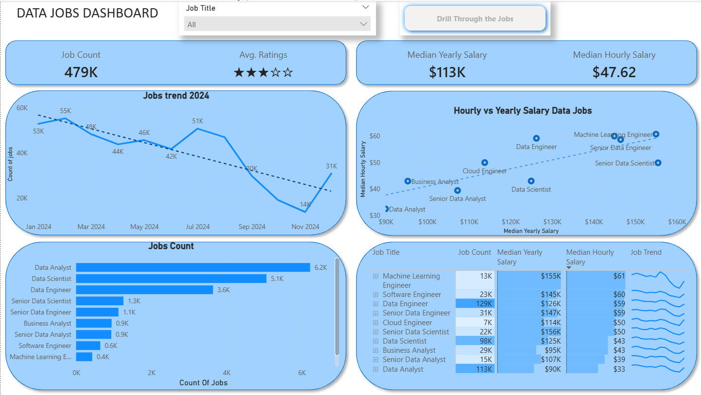
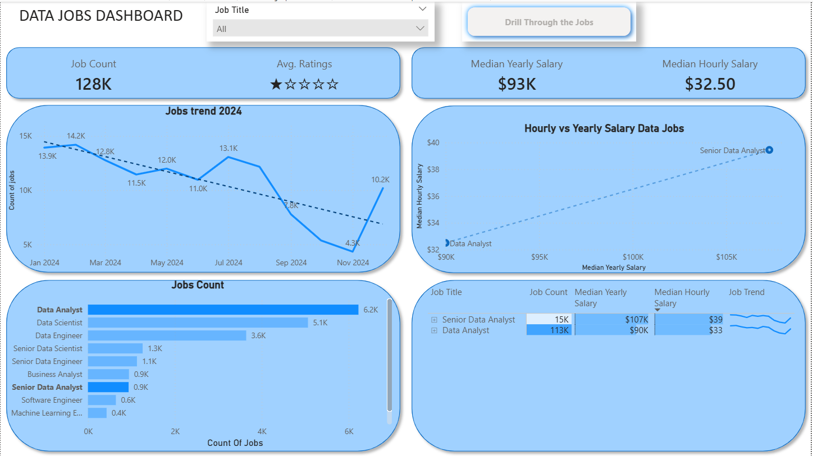
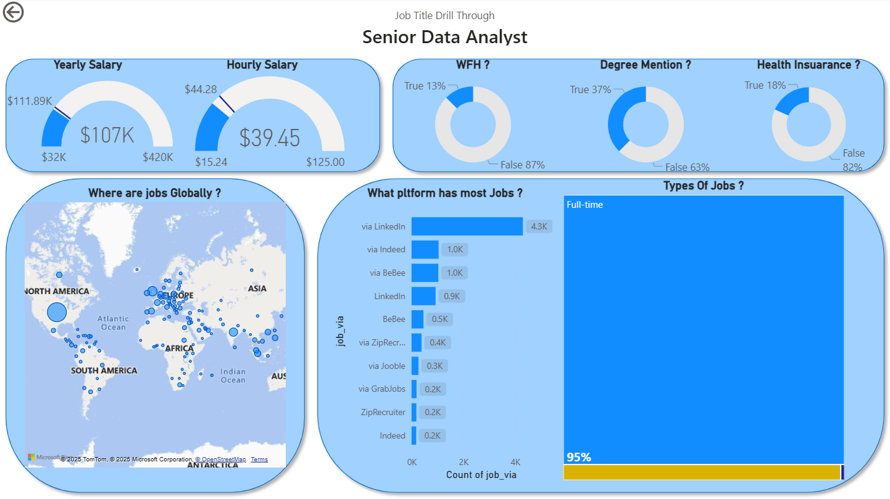

# Job Data Analysis — Power BI Project

This folder contains the Power BI report built to analyze job trends, salaries, job platforms, and global job availability across major data roles.  
The dataset used here is prepared from the Excel project linked below, which contains the raw and cleaned data.

---

## 📁 Files in This Folder
- **2.Job_Data_Analysis.pbix** — Main Power BI report  
- **Results_Snapshots/** — Contains report screenshots & GIF  
  - Dashboard.gif  
  - Dashboard_1.png  
  - Dashboard_2.png  
  - Dashboard_3.png  
- **readme.md** — Project documentation  

---

## 🔗 Source Data (Excel Project)

Raw data and all preparation steps are available here:

👉 **[Excel Project — Raw & Cleaned Dataset](https://github.com/utkarsh-naik10/EXCEL_PROJECTS/tree/main/1.Superstore%20Analysis)**

This Power BI report uses the cleaned and processed dataset exported from the above Excel workflow.
---

## 🎥 Full Dashboard Preview (GIF)

---

## 🖼️ Report Snapshots & Key Insights

### **1️⃣ Overview Dashboard**

**Insights:**  
- Total job count displayed across major data roles  
- Median yearly salary ≈ **$113K** and hourly ≈ **$47.62**  
- Overall job ratings show a moderate trend  
- Monthly job count trend shows a decline through mid-2024, with slight recovery at year end  

### **2️⃣ Salary & Role Comparison**

**Insights:**  
- Scatter chart compares median yearly vs hourly salary across job roles  
- Senior roles such as **Machine Learning Engineer**, **Senior Data Engineer**, and **Senior Data Scientist** show higher yearly and hourly compensation  
- Job Count by Title shows **Data Analyst** and **Data Scientist** are the most in-demand roles  

### **3️⃣ Drill-Through — Senior Data Analyst Example**

**Insights:**  
- Median salary for Senior Data Analyst ≈ **$107K**  
- **Work-from-home availability**: majority jobs are not remote  
- **LinkedIn** has the highest number of postings for this role  
- **95%+** of roles are full-time positions  
- Global map shows strong job presence in North America, Europe, and parts of Asia  

---

## ▶️ How to Use This Report
1. Install **Power BI Desktop**  
2. Download & open `2.Job_Data_Analysis.pbix`  
3. Use the **Job Title slicer** to filter roles  
4. Use the **drill-through button** to get detailed role-based insights  
5. Interact with visuals to explore salary trends & job counts  

---

## 🛠 Notes
- All measures and visuals are created inside the PBIX file  
- Data refresh depends on updating the dataset in Power BI  
- This project focuses solely on visualization — raw data lives in the Excel repository  

---
## 👤 Author
**Utkarsh Naik**  
📧 **utkarshnaik.in@gmail.com**