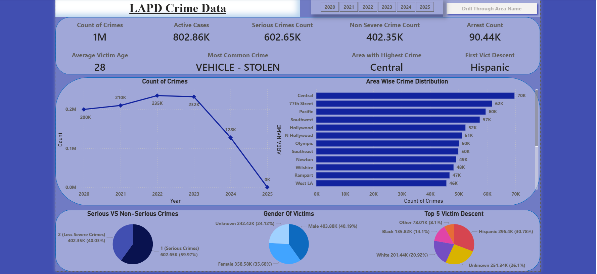
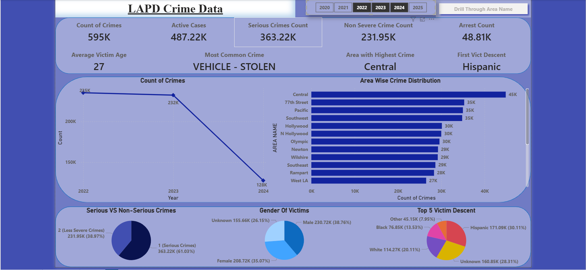
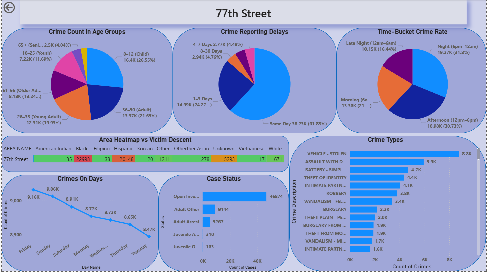
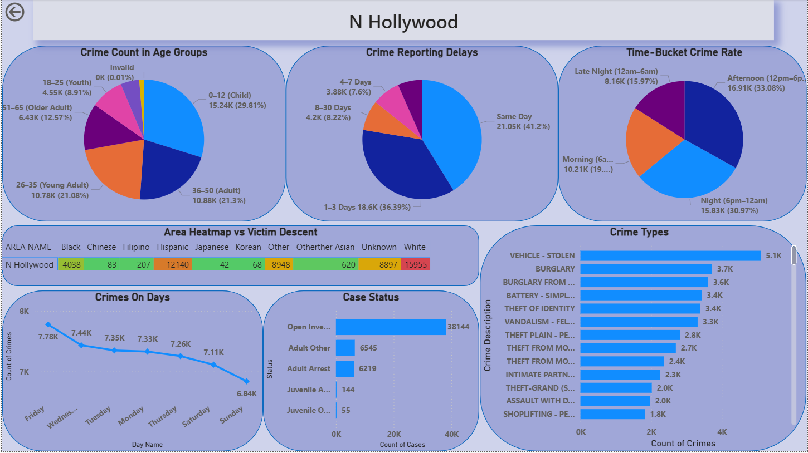

# LAPD Crime Data (2020–2025) — Power BI Dashboard

This Power BI project analyzes Los Angeles Police Department (LAPD) crime records from **2020 to 2025**, focusing on crime trends, victim demographics, area-wise crime distribution, and drill-through analysis at the division level.

The dataset was fully cleaned and prepared in Python.  
Raw + cleaned scripts are available here:

👉 **[Python Project — LAPD Crime Data (2020–Present)](https://github.com/utkarsh-naik10/PYTHON_PROJECTS/tree/main/4.Crime_Data_from_2020_to_Present)**

---

## 🎥 Dashboard Preview (GIF)

---

## 🖼️ **Dashboard 1 — Overall Crime Overview (2020–2025)**

### **Key Insights**
- Total recorded crimes: **1M+**
- Active cases: **802K**
- Most common crime type: **Vehicle – Stolen**
- Most crimes occur in **Central** division.
- **Hispanic** descent is the most common victim group.
- Crime trend peaked in **2022–2023**, followed by a decline in 2024–2025.
- Serious crimes account for **~60%** of all reported crimes.
- Gender distribution is balanced, with **Male** victims slightly higher than Female.

---

## 🖼️ **Dashboard 2 — Year-Specific View (2021–2023)**

### **Key Insights**
- Crime increased significantly from **2021 → 2022**, followed by a slight decrease in 2023.
- Central and 77th Street remain the **top crime-dense areas** across all three years.
- Serious vs non-serious crime ratios remain consistent year-to-year.
- Victim gender distribution shows:
  - **Male victims ≈ 40%**
  - **Female victims ≈ 36%**
  - **Unknown ≈ 22–25%**
- Hispanic descent remains the largest victim group (~31–32%).

---

## 🖼️ **Dashboard 3 — Drill Through: *77th Street Division***

### **Key Insights**
#### **Crime Breakdown**
- Largest victim age groups:
  - **0–12 (Child)**  
  - **36–50 (Adult)**  
  - **26–35 (Young Adult)**  
- Reporting delays:
  - Majority reported **Same Day (62%)**
  - Few cases reported after 7+ days.
- Time-of-day pattern:
  - Crimes highest during **Night (6pm–12am)** and **Afternoon**.
- Heatmap shows high counts among:
  - **Black** and **Hispanic** descent victims.
- Crime frequency highest on **Friday**.
- Most common crime types:
  - **Vehicle – Stolen**,  
  - **Assault**,  
  - **Battery – Simple**,  
  - **Theft of Identity**.

#### **Case Status**
- Major category: **Open Investigations (46K+)**  
- Arrests are considerably lower in comparison.

---

## 🖼️ **Dashboard 4 — Drill Through: *North Hollywood Division***

### **Key Insights**
#### **Crime Breakdown**
- Dominant victim ages:
  - **0–12 (Child)**  
  - **36–50 (Adult)**  
  - **26–35 (Young Adult)**
- Reporting pattern similar to 77th Street:
  - Majority **Same Day** and **1–3 Days**.
- Crime peak times:
  - **Afternoon (33%)**
  - **Night (31%)**
- Victim descent shows:
  - Highest among **White**, **Hispanic**, and **Unknown** categories.
- Crimes per day highest on **Friday** and lowest on **Sunday**.

#### **Case Status**
- Most cases marked as **Open Investigations (~38K)**.
- Arrest numbers similar across subcategories.

#### **Top Crime Types**
- **Vehicle – Stolen**  
- **Burglary**  
- **Battery – Simple Assault**  
- **Theft of Identity**

---

## 📌 **Project Summary**
- Built an interactive Power BI report showing **LAPD crime behavior over 6 years**.
- Features:
  - KPI summary cards  
  - Year-wise trends  
  - Area-wise distribution  
  - Victim demographics (age, gender, descent)  
  - Crime type breakdown  
  - Reporting delays  
  - Time bucket patterns  
  - Drill-through pages for area-specific insights  
---

## 👤 **Author**
**Utkarsh Naik**  
📧 *utkarshnaik.in@gmail.com*

